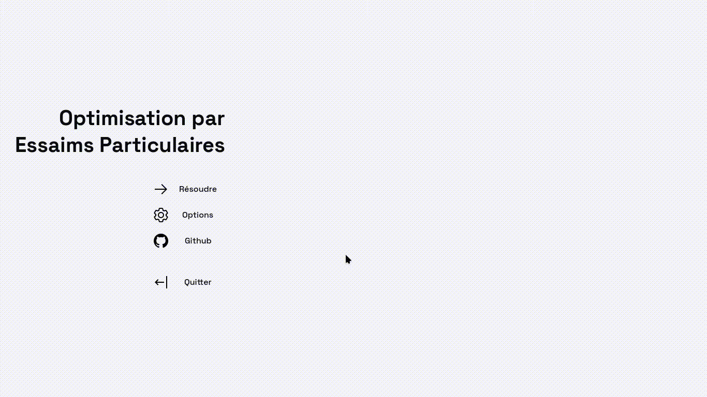

# Particle Swarm Optimization



## What it is about

This is a school project that is supposed to visualize the algorithm of PSO.

Given:

- a number of particles $N$ in a swarm
- an objective to reach, $P_i$ for each particle at time $t$
- a position, $X_i$ for each particle at time $t$ with

```math
X_i = \begin{pmatrix} x_i \\ y_i \end{pmatrix} \text{ and possibly } z_i
```

- a velocity, $V_i$ for each particle at time $t$
- a global objective, $P_g$ relative to the neighbourhood where

```math
P_g = \text{the position of the particle that is closest to the objective } P_i
```

> [!IMPORTANT]
>
> The goal is for each particle $i$ in the swarm to calculate its next velocity $V^{t+1}_i$
> based on 4 major parameters:
>
> - its current velocity $V^t_i$
> - its objective $P^t_i$
> - its position $X^t_i$
> - and the global objective $P^t_g$
>
> With additional parameters like:
>
> - $r_1$ and $r_2$, random numbers $\in [0, 1]$
> - $c_1$ and $c_2$, runtime-defined constants for tunning (respectively exploration/cognitive & exploitation/social)
> - $\omega$, the inertia

The formula :

```math
V^{t+1}_i = \omega V^t_i + c_1 r_1 (P^t_i - X_i) + c_2 r_2 (P^t_g - X_i)
```

## Usage

Just launch an either Windows/Linux version based on your system and :

- <kbd>Left click</kbd> for adding the target (and changing its place if it already exists)
- <kbd>Right click</kbd> for removing the target
